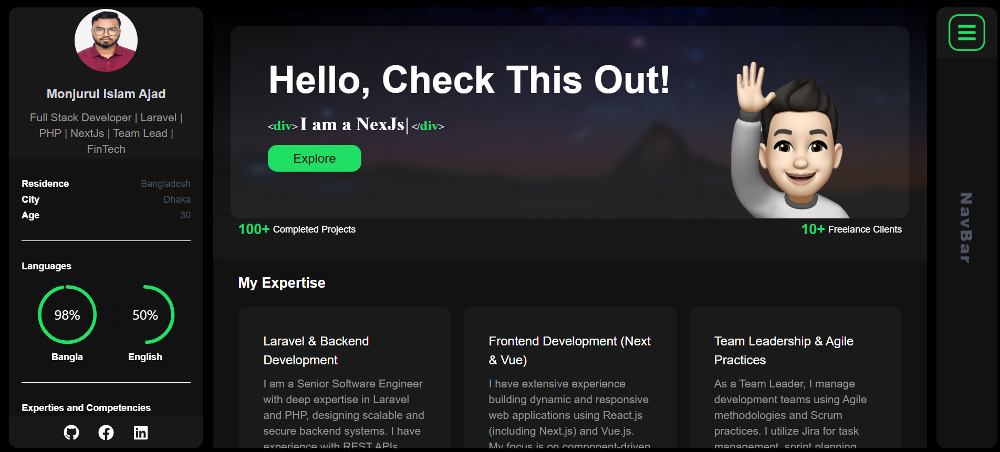

<div align="center">
  
  
  
  
  [](https://twitter.com/intent/follow?screen_name=monjur-ajad)

  <br />
  <br />
  
  

  <h2 align="center">Monjur Ajad - Personal portfolio</h2>

This website is fully responsive personal portfolio, <br />Responsive for all devices, built using Nextjs, TailwindCSS only.

<a href="https://monjurajad.com/"><strong>➥ Live Demo</strong></a>

</div>

<br />

### Demo Screeshots



### Prerequisites

Before you begin, ensure you have met the following requirements:

- [Git](https://git-scm.com/downloads "Download Git") must be installed on your operating system.

### Run Locally

To run **portfolio** locally, run this command on your git bash:

Linux and macOS:

```bash
sudo git clone https://github.com/MonjurAjad/portfolio.git
```

Windows:

```bash
git clone https://github.com/Monjurul-Islam-Ajad/portfolio.git
```

### Contact

If you want to contact with me you can reach me at [X](https://www.x.com/Monjur-Ajad).

### License

This project is **free to use** and does not contains any license.
